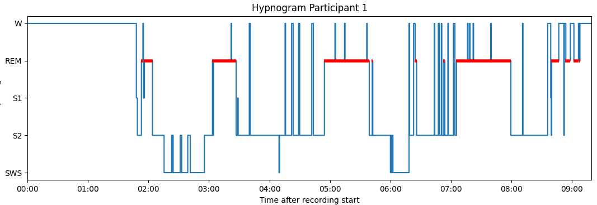
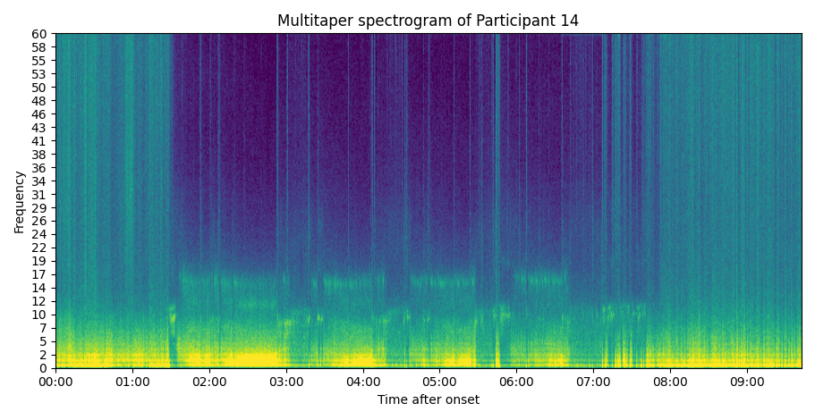
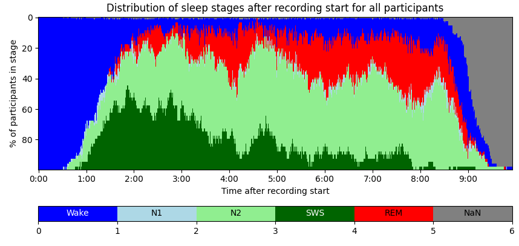

# sleep-utils

A python toolbox for sleep researchers. Plot hypnograms, spectrograms, confusion matrices, PSG summaries







```
Hypnogram summary
{'TRT': 460.5,
 'TST': 444.5,
 'WASO': 16.0,
 'lat_REM': 65.0,
 'lat_S1': 0.0,
 'lat_S2': 2.0,
 'lat_S3': 9.0,
 'min_REM': 109.5,
 'min_S1': 13.5,
 'min_S2': 214.0,
 'min_S3': 107.5,
 'perc_REM': 0.24634420697412823,
 'perc_S1': 0.030371203599550055,
 'perc_S2': 0.4814398200224972,
 'perc_S3': 0.24184476940382452,
 'perc_W': 0.03474484256243214,
 'recording_length': 547.0,
 'sleep_offset_after_rec_start': 534.0,
 'sleep_onset_after_rec_start': 73.5}
```

#### Install

```
pip install sleep-utils
```

or

```
pip install git+https://github.com/skjerns/sleep-utils
```

#### Functionality

`import sleep_utils`

- hypnograms
  
  - load (`sleep_utils.read_hypno(file)`)
  
  - save(`sleep_utils.write_hypno(hypno, file)`
  
  - plot (`sleep_utils.plot_hypnogram(hypno)`)
  
  - convert (read&save)
  
  - print summary (TST, WASO, ...) (`sleep_utils.hypno_summary(hypno)`)

- spectrograms
  
  - multitaper spectrogram (`sleep_utils.specgram_multitaper(data, sfreq)`)
  
  - welch spectrogram(`sleep_utils.specgram_welch(data, sfreq)`)

- confusion matrix
  
  - plot inter rater confusion matrix (`sleep_utils.plot_confusion_matrix(confmat)`)

- mne-edf
  
  - save MNE to edf (`sleep_utils.write_mne_edf(raw, filename)`)